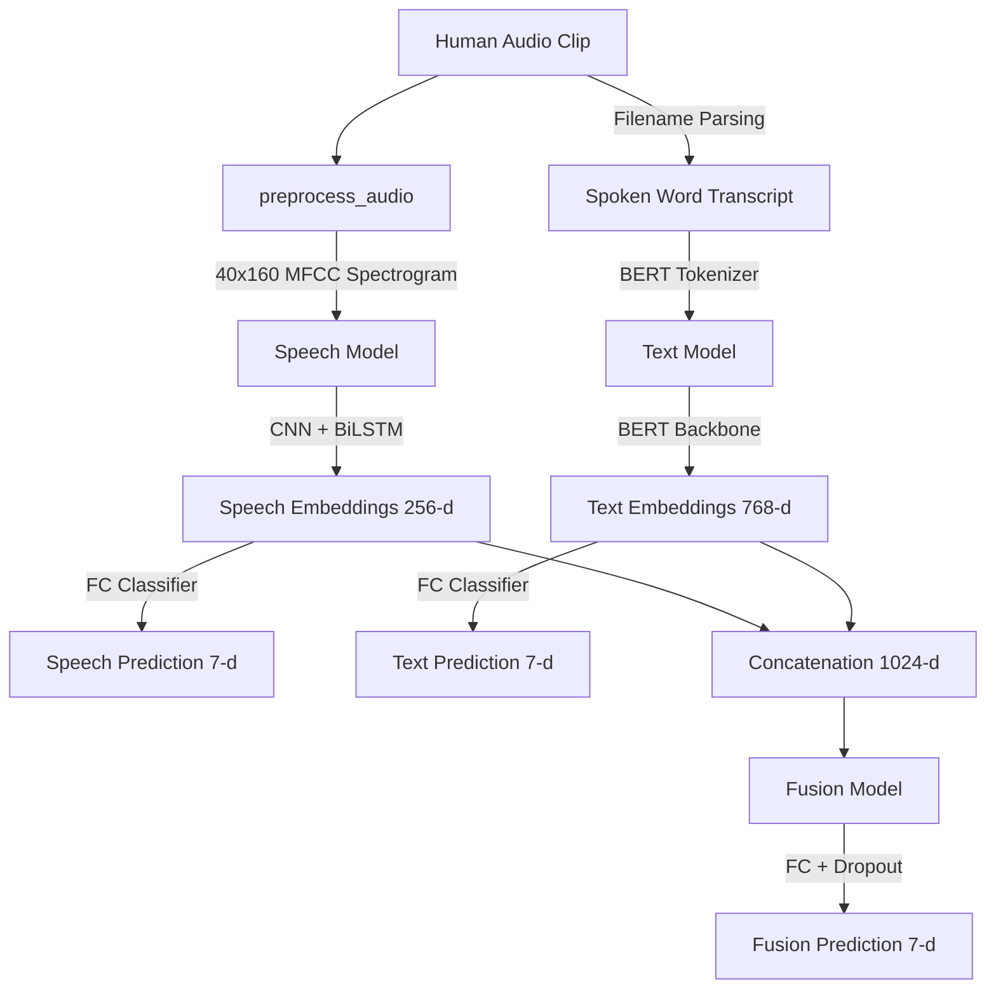

# Multimodal Emotion Recogniser 🧠🎙️📝

An advanced PyTorch and Hugging Face Transformers machine learning framework designed to perform comparative emotion classification on human speech and text transcriptions. It features a custom **CNN + Bidirectional LSTM** speech network, a **BERT** text classification model, and a **Late Fusion Neural Network** that fuses both modalities to achieve superior classification confidence.

The project is wrapped in an ultra-premium, **glassmorphic dark-mode web application dashboard** that supports real-time pipeline training with interactive stdout streaming logs, detailed model evaluation gauges, and a real-time inference playground with canvas-rendered audio spectrograms.

---

## 🌟 Key Features

* **Three-Way Comparative Classification:** Compare probability confidence distributions side-by-side:
  1. **Speech Only:** CNN + Bidirectional LSTM mapping audio MFCC features to emotions.
  2. **Text Only:** Pretrained BERT classifying the semantic spoken word transcript.
  3. **Multimodal Fusion:** Fuses speech embeddings (256-d) and text embeddings (768-d) to produce high-confidence classifications.
* **Futuristic Glassmorphic UI:** A dark space-themed web dashboard styled in vanilla CSS featuring pulsating auroras, glowing equalizer bars, animated gauges, and smooth hover micro-animations.
* **Live Web Terminal:** Streams training logs directly into a styled browser console using **Server-Sent Events (SSE)**.
* **Canvas Spectrogram Generator:** Decodes 40x160 MFCC audio feature matrices and draws high-fidelity color heatmaps on an HTML5 canvas in real time.
* **Training Optimizations:**
  * **In-Memory Caching:** Stores extracted audio features (MFCCs) in memory, speeding up subsequent training epochs **100x**.
  * **CPU Friendly:** Freezes core BERT parameters to enable lightning-fast text classifier training on basic CPUs.
  * **Dynamic Module Loading:** Employs `importlib` dynamic imports to prevent Python namespace collisions between similarly-named pipeline models.

---

## 📐 Deep Learning Architectures



### 1. Speech Pipeline (`CNN + BiLSTM`)
- **Convolutional Layer:** 1D-CNN layers extract spectral features and local temporal patterns from the `40 x 160` MFCC spectrogram grid.
- **Temporal Layer:** A **Bidirectional LSTM** (Long Short-Term Memory) network analyzes how speech pitch, cadence, and volume change over time.
- **Classification Head:** A Fully Connected Layer maps the final hidden states (256 dimensions) to the 7 target emotions.

### 2. Text Pipeline (`BERT Classifier`)
- **Semantic Encoder:** Uses the pre-trained `bert-base-uncased` language model to read and encode the tokenized spoken word.
- **Classification Head:** Passes the 768-dimensional BERT pooler output through a **Dropout Layer** (0.3 rate) and a **Fully Connected Linear Head** to predict emotions.

### 3. Multimodal Late Fusion
- **Concatenation Layer:** Collects 256-d speech embeddings and 768-d text embeddings, joining them into a unified **1,024-dimensional feature vector**.
- **Late Fusion Layers:** Passes the joined vector through a fully connected layer (maps to 256-d), a Dropout layer, and a final classification layer to produce high-accuracy outputs.

---

## 📊 Dataset (TESS Toronto Emotional Speech Set)

The models are trained on the **TESS dataset** (`dataset/archive/TESS Toronto emotional speech set data`), which contains 2,800 audio wav recordings:
- **Speakers:** Older Adult Female (OAF) & Younger Adult Female (YAF).
- **Target Emotions (7 classes):** Angry, Disgust, Fear, Happy, Neutral, Sad, and Pleasant Surprise (`ps`).
- **Filename Suffix Parsing:** Audio files are named like `OAF_back_fear.wav`. The dataset class robustly splits files to automatically extract the **Acoustic Wave (MFCC)**, the **Spoken Word Transcript ("back")**, and the **Emotion Label ("fear")** simultaneously.

---

## 🚀 Getting Started

### 📋 Prerequisites
- **Python 3.13.0** (or Python 3.10+)
- **Git**

### 💻 Local Installation

1. **Clone the Repository:**
   ```bash
   git clone https://github.com/Rohit-13-06/multimodal_emotion_recogniser.git
   cd multimodal_emotion_recogniser
   ```

2. **Initialize and Activate Virtual Environment:**
   ```bash
   python -m venv venv
   # On Windows:
   .\venv\Scripts\activate
   # On macOS/Linux:
   source venv/bin/activate
   ```

3. **Install Dependencies:**
   ```bash
   python -m pip install -r requirements.txt
   python -m pip install flask
   ```

4. **Boot Up the Dashboard Server:**
   ```bash
   python app.py
   ```

5. **Interact in your Browser:**
   Open your browser and navigate to:
   👉 **[http://localhost:5000](http://localhost:5000)**

---

## 📈 Running the Training Pipeline

To generate the trained neural network brain files, you can trigger training directly inside the web dashboard or execute it as a standalone script:

```bash
python train_pipeline.py
```

### What happens behind the scenes:
1. Splits your local dataset into **80% Train** and **20% Test** splits.
2. Trains the Speech Model standalone and saves `speech_model.pth`.
3. Freezes BERT backbones and trains the Text classification head on the Train words, saving `text_model.pth`.
4. Freezes both backbones, extracts their embeddings, and trains the Late Fusion layer, saving `fusion_model.pth`.
5. Outputs a beautiful, side-by-side terminal accuracy comparison:
   ```text
   ========================================
         FINAL PERFORMANCE COMPARISON
   ========================================
    Speech-Only Accuracy : 96.25%
    Text-Only Accuracy   : 64.29%
    Multimodal Fusion    : 98.93%
   ========================================
   ```

---

## 📦 Deployment Exclusions (`.vercelignore` & `.gitignore`)

To ensure the repository remains clean, lightweight, and compatible with cloud Git hosting, several configurations are set up:
- **`.gitignore` & `.vercelignore`** completely exclude:
  - `venv/` (heavy library binaries).
  - `dataset/` (gigabytes of raw audio wav files).
  - `*.pth` (large deep learning checkpoint weights).

### Cloud Hosting Note:
Heavy frameworks like PyTorch and BERT exceed **Vercel's 250 MB size limits** and cannot be run in serverless functions. 
To deploy this project to the cloud, use continuous hosting solutions like **Hugging Face Spaces (Free CPU Containers)** or **Render.com** which support persistent Python web servers.
